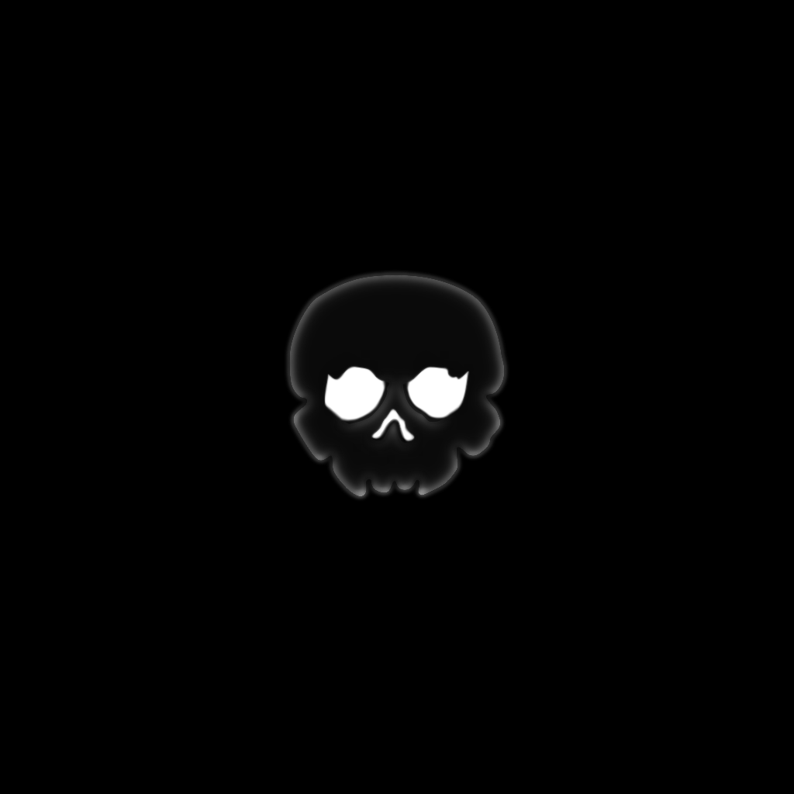

# FromBones

A 2D plateformer game with integrated editor.
Up to 4 local players.

## Build Prerequisites

- **CMake** installed.

## Native Build Instructions

 Use CMake to generate the build files.

    cmake -S . -B build
    cmake --build build --config Release
   
## Installation

Once the build is complete, you can install the project using the appropriate installation command.

    cmake --install build

Default installation path: ./exe/bin

## To Do

See notes folders.

Finalize vk port and network.

## Platforms

**Tested:** Windows, Linux, Android

